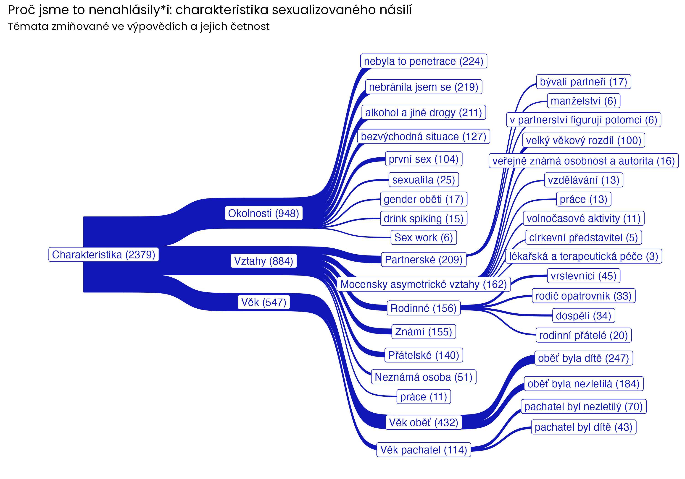
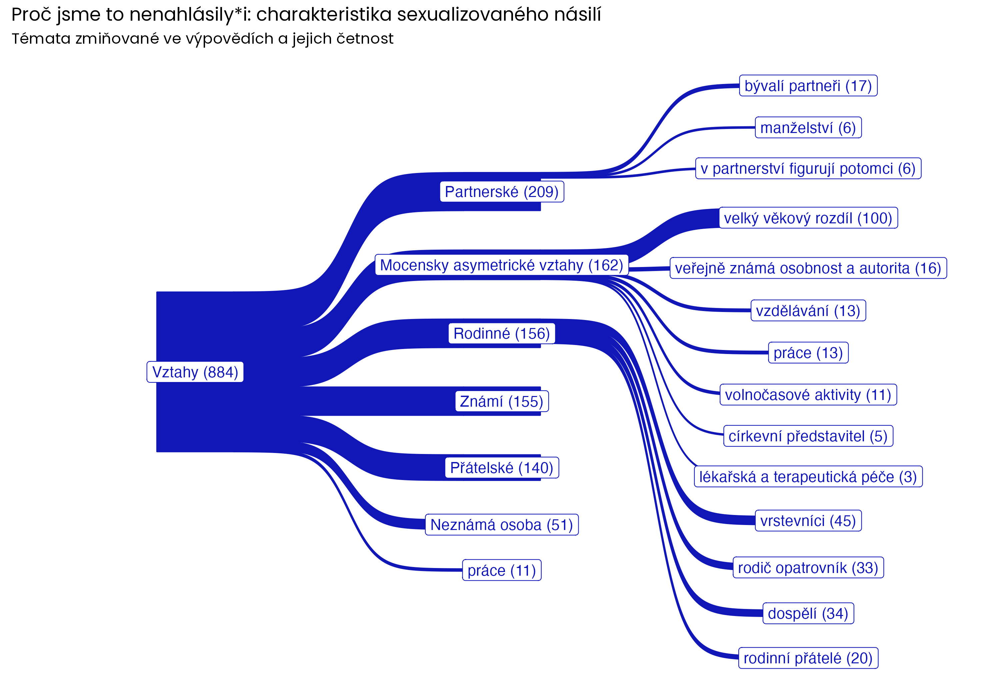
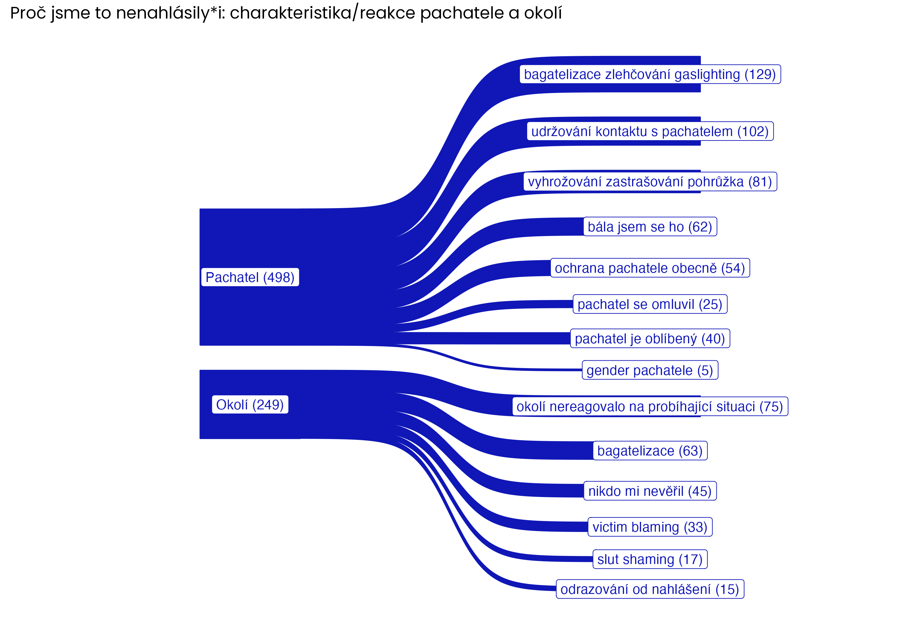
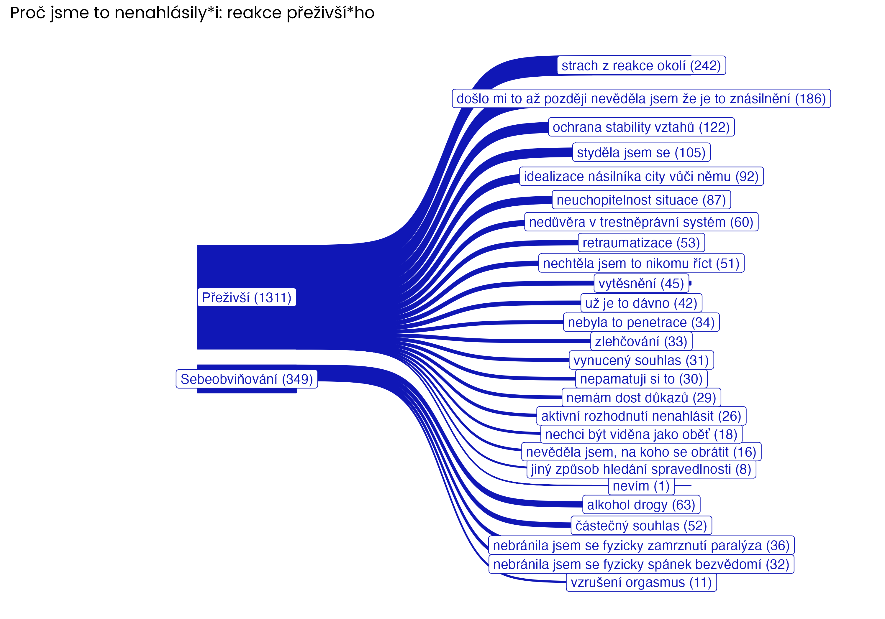
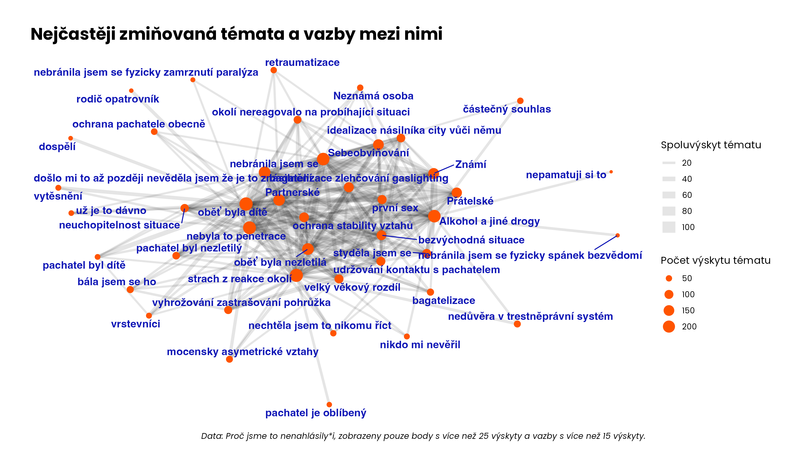
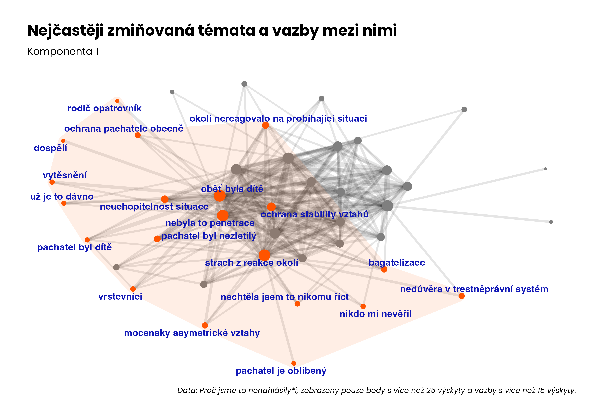
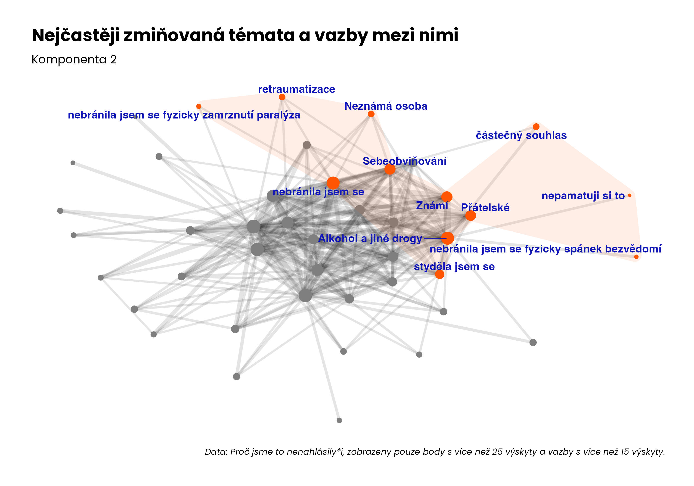
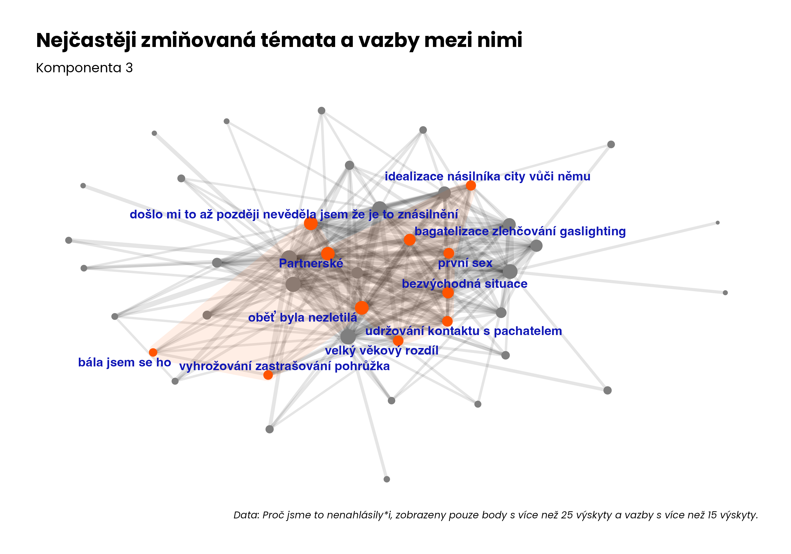

## README

Replikační materiály pro prototypy vizualizace k projektu "Proč oběti nenahlašují připady sexualizovaného násilí?". Výzkumná zpráva [tady](https://www.procjsmetonenahlasili.org/vyzkum).

## Grafy četností témat (kódů) zmiňovaných oběťmi

## Grafy vazeb mezi tématy

### Detekce komunit pomocí Louvain method

