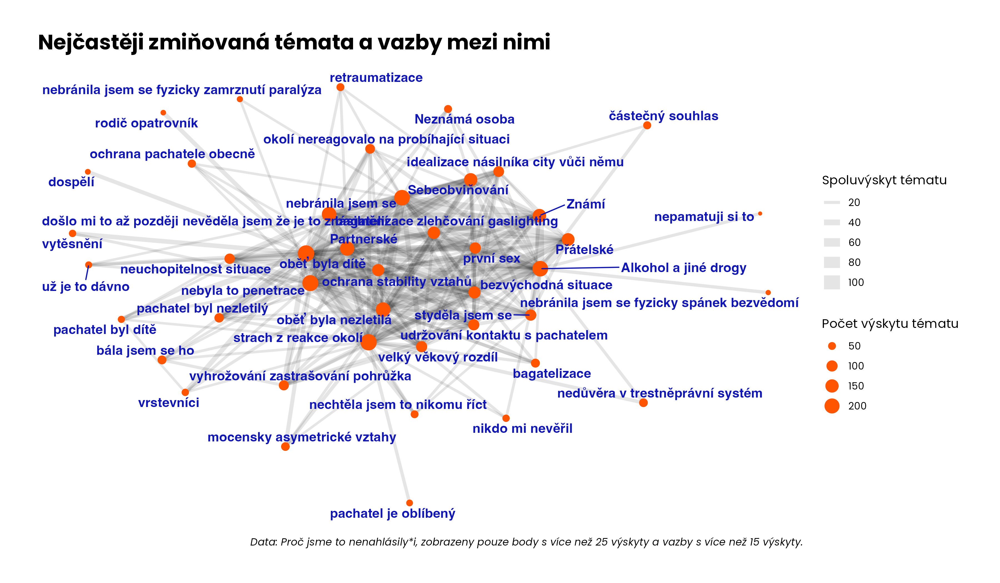

## README

Replikační materiály pro vizualizace k projektu "Proč oběti nenahlašují připady sexualizovaného násilí?".

## Grafy četností témat (kódů) zmiňovaných oběťmi

## Grafy vazeb mezi tématy

Detekce komunit pomocí Louvain method.

